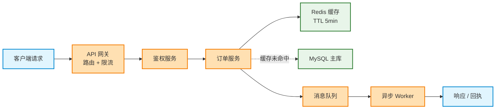
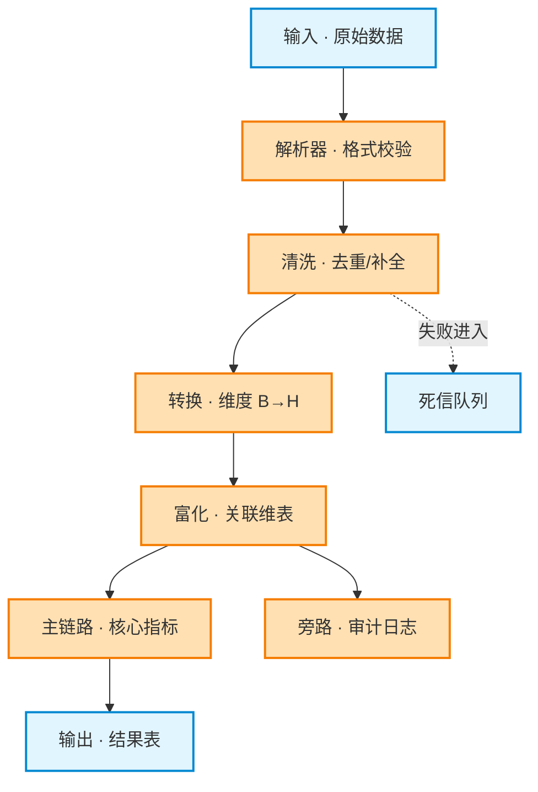
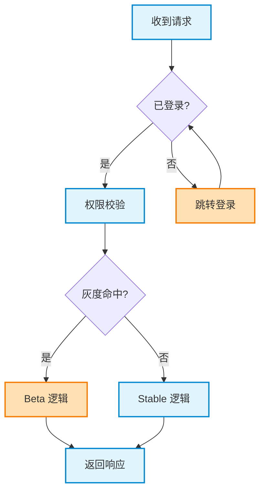
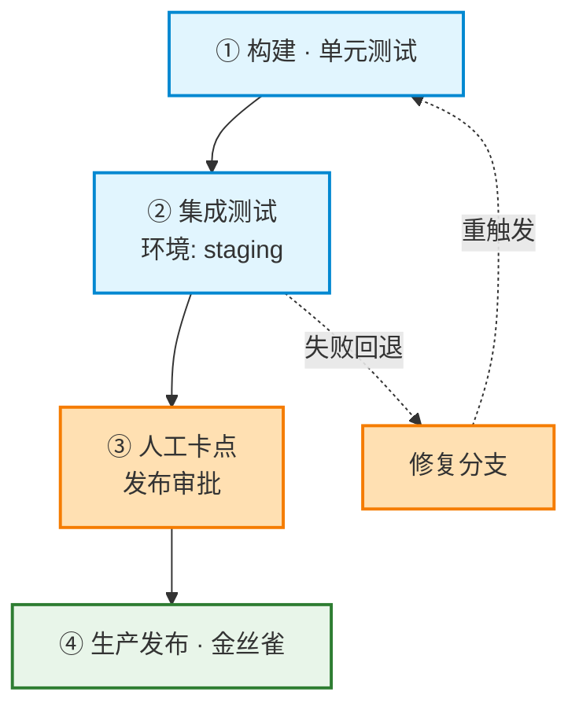

# Mermaid 技术文档图表

## 设计原则（最高优先级）

**清晰 > 完整 > 美观**：目标是「一眼能读懂」——不是「看起来专业但很乱」，也不是「为了简单删掉技术细节」。

| 优先级 | 原则 |
|--------|------|
| 1 | **布局清晰**：单一主阅读方向，少交叉、少横跳 |
| 2 | **信息完整**：维度、阶段、参数、开关等关键细节保留在节点或图下说明 |
| 3 | **语义配色**：2～3 种颜色足够，颜色必须对应固定语义 |
| 4 | **图外补说明**：图上方一句「怎么读」，图下图例/表格承接细节 |

### 禁止事项（比「必须做什么」更重要）

- ❌ 用多个 `subgraph` 把主链拆散，再跨 subgraph 连线（最易导致混乱）
- ❌ 为了「高级感」堆 4 种以上 `classDef`、渐变、阴影、`linkStyle`
- ❌ 为求简单删掉阶段、维度、参数、编号等技术信息
- ❌ 所有边都强制加标签（主链实线不加，分支/旁路/续接才加）
- ❌ 节点 ID 用 `A/B/C`，或节点文案写成段落

---

## 工作流

1. **明确读者与用途** — 这张图给谁看、解决什么问题（理解架构？跟流程？查状态？），决定信息密度。
2. **提取信息要素** — 从源材料（文档/代码/用户描述）列出必须保留的信息：节点、方向、分支条件、关键参数；**重画已有图时先读原文档要表达的信息，不重新发明内容**。
3. **选择图类型** — 按下方「图类型决策表」。
4. **选择布局模式** — flowchart 按下方四种布局模式套用。
5. **生成 + 自检** — 过一遍「质量检查清单」；无法本地渲染验证时至少确认引号、括号、特殊字符已按「语法陷阱」处理。

## 图类型决策表

| 要表达的内容 | 首选图类型 | 备注 |
|---|---|---|
| 数据流 / 模块依赖 / 宏观架构 | `flowchart LR` | 主链一条线，支路下方汇入 |
| 模块内部拓扑 / 处理管道 | `flowchart TD` | 竖直主链，分叉在末尾 |
| 判断分支（if/else） | `flowchart TD` | 菱形 → 分支 → 汇合 |
| 多角色按时间交互 | `sequenceDiagram` | 不用 flowchart 硬画时序 |
| 对象生命周期 / 阶段开关 | `stateDiagram-v2` | 转换边写条件 |
| 静态数据模型 | `erDiagram` | PK/FK + 基数 |
| 类/接口关系 | `classDiagram` | 访问修饰符 + 关系动词 |
| 项目排期 | `gantt` | `section` 分区 + 里程碑 |

---

## 流程图布局模式

### 方向选择

| 内容类型 | 方向 | 布局模式 |
|----------|------|----------|
| 宏观架构 / 数据流 | `LR` | 单条主链 + 必要支路 |
| 模块内部拓扑 | `TD` | 竖直主链，分叉在末尾 |
| 判断分支 | `TD` | 菱形 → 分支 → 汇合 → 下一步 |
| 流水线 / 阶段推进 | `TD` | ①②③ 编号竖排；续接/回退用虚线 |

### 模式 A：宏观架构（LR 主链 + 支路）



要点：主路径从左到右一条线；支路在下方汇入或以虚线标注条件，不嵌 subgraph。

### 模式 B：模块拓扑（TD 主链 + 末尾分叉）



要点：
- 先声明全部节点，再写连线（可读性更好）
- 主链不断裂；旁路/异常路径用 `-.->` 虚线并标注语义
- 分叉控制在 2～3 路，并列向下，不再套 subgraph

### 模式 C：条件分支（TD 顺序判断）



要点：判断按阅读顺序自上而下；每个菱形后的分支汇合再进入下一判断；条件写在边标签上。

### 模式 D：流水线（编号 TD + 虚线续接）



要点：主流程一条竖链；阶段参数（时长、环境、版本）写在节点内（≤2 行 `<br/>`）；回退/续接路径用虚线，细节表格放图外。

---

## 视觉规范

### 配色（固定语义，不超过 3 种）

```mermaid
classDef primary fill:#e1f5fe,stroke:#0288d1,stroke-width:2px
classDef accent fill:#ffe0b2,stroke:#f57c00,stroke-width:2px
classDef terminal fill:#e8f5e9,stroke:#2e7d32,stroke-width:2px
```

| class | 语义 | 用于 |
|-------|------|------|
| `primary` | 主流程 / 常规节点 | 常规处理步骤 |
| `accent` | 关键决策 / 特殊路径 | 判断、灰度、异常、人工卡点 |
| `terminal` | 端点 / 最终状态 | 输入输出、终点、上线 |

配色必须跨图一致（同一篇文档里蓝色始终表示同一语义）；**不要**为每种节点类型单独配色。需要区分「决策节点」时优先用菱形形状，而不是加第四种颜色。

### 节点文案规范

- **节点 ID**：驼峰语义化（`authService`、`stage1Train`），禁止 `A/B/C`
- **显示文本**：`模块名 · 关键参数` 格式，最多 2 行（用 `<br/>`）
- **必写信息**（按场景选取，源材料已有的不可省略）：
  - 数据维度 / 变换：`B→H`、`row→json`
  - 状态 / 开关：`已启用`、`A=关闭`
  - 阶段差异：`stage2 可选`
  - 流水线参数：`时长`、`环境`、`版本号`
- **边标签**：只在分支条件、旁路、回退/续接、数据语义非显然时添加

### subgraph 使用规则

**默认不用 subgraph。** 仅在以下情况使用，且 subgraph 内部连线不得跨区乱飞：

| 可用 | 不可用 |
|------|--------|
| 单图 >12 节点且存在明确物理分区（如「客户端/服务端」） | 把同一条主链拆进 2～3 个 subgraph |
| 并行的 2 个独立子系统，彼此仅 1～2 条边 | 用 subgraph 做「装饰性分区」 |
| C4 / 部署拓扑等多层架构 | 在 subgraph 间来回交叉连线 |

---

## 语法陷阱速查

渲染失败多半出在这些地方，生成后自检：

| 陷阱 | 正确写法 |
|------|----------|
| 节点文本含 `() [] {}` 会被解析为形状语法 | 文本用引号包裹：`n1["函数(带括号)"]` |
| 文本含 `#` 引发实体解析 | `#` 写成 `#35;` |
| 节点内换行 | `<br/>`（不是 `\n`） |
| 文本以引号内再嵌引号 | 内层改用单引号或全角引号 |
| 边标签写长句子 | 标签精简为条件/语义短语，细节放图外 |
| `end` 作为节点 ID 末尾（如 `backend`）触发块结束误判 | 改名（如 `srvBackend`） |
| `classDef` 写在节点声明前引用 `:::` 无效 | `classDef` 声明可放图任意位置，但 `:::` 只作用于其后声明的节点引用 |

Mermaid v11.3+ 支持通用形状语法 `A@{ shape: person }`、`@{ shape: document }` 等约 30 种形状；仅当默认形状（矩形/菱形/圆角/圆柱）不足以表达语义时选用，不为了新颖混用。

## 其他图类型要点

非 flowchart 场景同样保持「清晰 > 装饰」原则。

### 时序图 (sequenceDiagram)

- 参与者语义化命名，数量 ≤6；更多角色时按子域拆图
- 用 `alt/else`、`loop`、`opt` 表达分支与循环，避免在 flowchart 里硬画时序
- 关键步骤加 `Note`，不必每步都编号

### 状态图 (stateDiagram-v2)

- 生命周期、阶段切换优先用状态图或表格
- 转换边上写触发条件（如 `审核通过 → 已发布`）
- 复合状态（`state X { ... }`）仅在确实有嵌套生命周期时使用

### 类图 / ER 图 / 甘特图

- 类图：访问修饰符 + 关系动词（`--\|>` 继承、`..o` 聚合）
- ER 图：PK/FK + 基数（`||--o{`）
- 甘特图：`section` 分区 + 里程碑，任务粒度对齐排期文档

复杂企业级场景（C4、Git 分支、用户旅程）按原 Mermaid 语法即可，**不套用 flowchart 的 subgraph 堆砌规则**。

---

## 常见错误对照

| 错误做法 | 正确做法 |
|----------|----------|
| 3 个 subgraph 横排，连线横跨 | 扁平 TD/LR 主链，必要时末尾分叉 |
| 6 种 classDef 区分 input/decision/process/output | 2～3 种语义色 + 形状区分（菱形=判断） |
| 节点只写「转换」 | 写 `转换 · 维度 B→H · 去重` |
| 图内写不下就删掉参数 | 节点保留关键数，表格放图外 |
| 所有边都加 `"数据流"` 标签 | 主链实线无标签，分支/虚线才标注 |
| 「绝不生成简单图」式 over-engineering | 信息完整 + 布局简单 |

---

## 质量检查清单

生成完成后自检：

- [ ] 图上方有一句「怎么读这张图」
- [ ] 3 秒内能说出主阅读方向（LR 或 TD）
- [ ] 主链不断裂、无 subgraph 交叉连线
- [ ] 源材料中的技术细节未因「简化」而丢失
- [ ] 配色 ≤3 种，且有图例说明语义
- [ ] 节点 ID 语义化；节点文案 ≤2 行
- [ ] 仅分支/旁路/续接等非显然边有标签
- [ ] 表格、公式、参数等重复细节放在图外
- [ ] 语法陷阱已过一遍（引号、括号、`end`、换行）

---

## 输出格式（Markdown 文档）

每张图按此结构输出：

```markdown
### 小节标题

一句导读：说明图的阅读方向与核心结构（例：主链自上而下，末尾 Y 形分叉）。

​```mermaid
... 图代码 ...
​```

**图例** 或补充要点（承接表格/公式，不重复整张图的内容）
```
