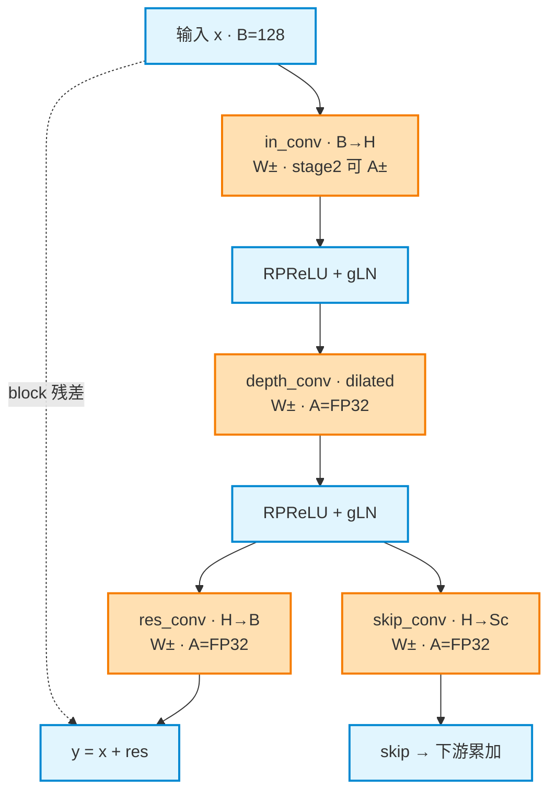
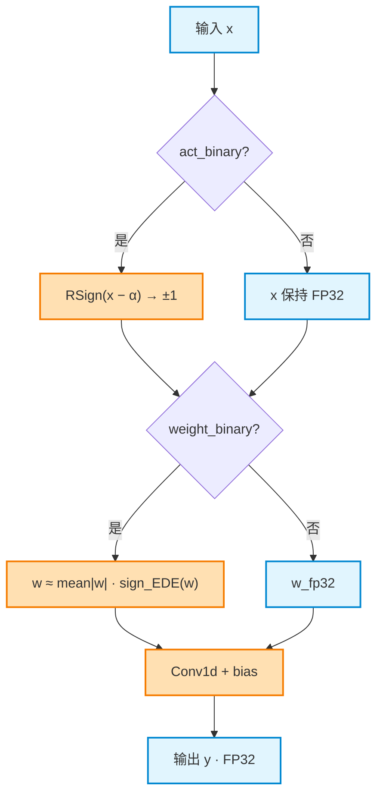
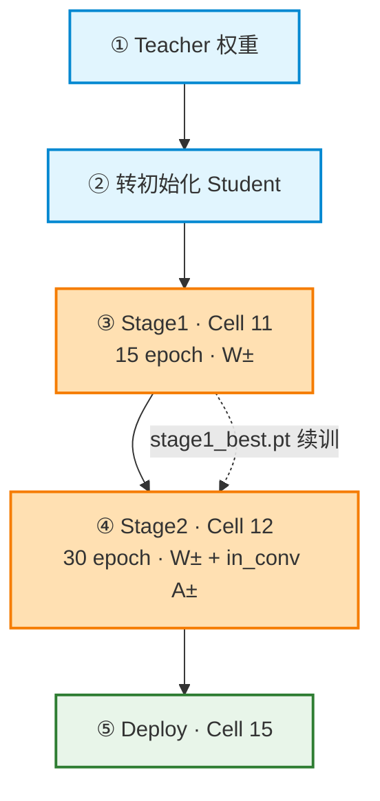

# Mermaid 技术文档图表

## 最高优先级：清晰 > 完整 > 美观

用户反馈的核心诉求：**一眼能读懂**，不是「看起来很专业但很乱」，也不是「为了简单删掉技术细节」。

| 优先级 | 原则 |
|--------|------|
| 1 | **布局清晰**：单一主阅读方向，少交叉、少横跳 |
| 2 | **信息完整**：W±/A±、维度、阶段、Cell 等关键细节保留在节点或图下说明 |
| 3 | **语义配色**：2～3 种颜色足够，颜色必须对应固定语义 |
| 4 | **图外补说明**：图上方一句「怎么读」，图下图例 / 表格承接细节 |

### 禁止事项（比「必须做什么」更重要）

- ❌ 用多个 `subgraph` 把主链拆散，再跨 subgraph 连线（最易导致混乱）
- ❌ 为了「高级感」堆 4 种以上 `classDef`、渐变、阴影、`linkStyle`
- ❌ 为求简单删掉 stage、维度、公式、Cell 编号等技术信息
- ❌ 所有边都强制加标签（主链实线可不加，分支 / 残差 / 续训才加）
- ❌ 节点 ID 用 `A/B/C`，或节点文案写成段落

---

## 输出格式（Markdown 文档）

每张图按此结构输出：

```markdown
### 小节标题

一句导读：说明图的阅读方向与核心结构（例：主链自上而下，末尾 Y 形分叉）。

​```mermaid
... 图代码 ...
​```

**图例** 或补充要点（承接表格 / 公式，不重复整张图的内容）
```

---

## 流程图 (flowchart) — 最常用

### 方向选择

| 内容类型 | 方向 | 布局模式 |
|----------|------|----------|
| 宏观数据流（Encoder→Sep→Decoder） | `LR` | 单条主链 + 必要支路（如 mask 乘法） |
| 模块 / Block 内部拓扑 | `TD` | **竖直主链**，分叉在末尾 |
| 判断分支（if/else 前向） | `TD` | 菱形 → 分支 → **汇合** → 下一步 |
| 训练 / 部署流水线 | `TD` | **①②③ 编号**竖排；续训用虚线 |

### 推荐布局模式

#### 模式 A：宏观架构（LR 主链 + 支路）


要点：主路径从左到右一条线；支路（`feat → mul`）在下方汇入，不嵌 subgraph。

#### 模式 B：Block 拓扑（TD 主链 + 末尾 Y 分叉）



要点：
- 先声明全部节点，再写连线（可读性更好）
- 主链 `x --> ic --> ... --> n2` 不断裂
- 残差 / shortcut 用 `-.->` 虚线，并标注语义
- 分叉最多 2 路，并列向下，不再套 subgraph

#### 模式 C：条件分支（TD 顺序判断）



要点：判断按阅读顺序自上而下；每个菱形后分支汇合再进入下一判断。

#### 模式 D：训练流水线（编号 TD + 虚线续训）



要点：主流程一条竖链；epoch / lr / 开关可写在节点内（≤2 行 `<br/>`）；细节表格放图外。

---

## 配色（固定语义，不超过 3 种）

技术方案文档默认配色：

```mermaid
classDef fp fill:#e1f5fe,stroke:#0288d1,stroke-width:2px
classDef bin fill:#ffe0b2,stroke:#f57c00,stroke-width:2px
classDef dep fill:#e8f5e9,stroke:#2e7d32,stroke-width:2px
```

| class | 语义 | 用于 |
|-------|------|------|
| `fp` | FP32 / 豁免模块 | Encoder、归一化、残差加法 |
| `bin` | 可二值 / 训练阶段 | 二值卷积、Stage1/2 |
| `dep` | 部署 / 终点 | Deploy、最终输出 |

仅在确实需要区分「决策节点」时，可额外增加一种浅色菱形样式；**不要**为每种节点类型单独配色。

---

## 节点文案规范

- **节点 ID**：驼峰语义化（`inConv`、`stage1Train`），禁止 `A/B/C`
- **显示文本**：`模块名 · 关键参数` 格式，最多 2 行（用 `<br/>`）
- **必写信息**（按场景选取，不可省略文档已有的）：
  - 张量维度：`B→H`、`H→Sc`
  - 二值状态：`W±`、`A±`、`A=FP32`
  - 阶段差异：`stage2 可 A±`
  - 流水线：`Cell 11`、`15 epoch`、`lr 5e-4`
- **边标签**：只在分支条件、残差、续训、数据语义非显然时添加

---

## subgraph 使用规则

**默认不用 subgraph。** 仅在以下情况使用，且 subgraph 内部连线不得跨区乱飞：

| 可用 | 不可用 |
|------|--------|
| 单图 >12 节点且存在明确物理分区（如「客户端 / 服务端」） | 把同一条主链拆进 2～3 个 subgraph |
| 并行的 2 个独立子系统，彼此仅 1～2 条边 | 用 subgraph 做「装饰性分区」 |
| C4 / 部署拓扑等多层架构 | 在 subgraph 间来回交叉连线 |

---

## 其他图表类型（按需选用）

非 flowchart 场景仍保持「清晰 > 装饰」原则，不强制 subgraph / 多配色。

### 时序图 (sequenceDiagram)

- 参与者语义化命名
- 用 `alt/else`、`loop` 表达分支，避免在 flowchart 里硬画时序
- 关键步骤加 `Note`，不必每步都编号

### 状态图 (stateDiagram-v2)

- 生命周期、阶段开关（stage1/stage2/deploy）优先用状态图或表格
- 转换边上写条件（如 `软→硬 ±1`）

### 类图 / ER 图 / 甘特图

- 类图：访问修饰符 + 关系动词
- ER 图：PK/FK + 基数
- 甘特图：`section` 分区 + 里程碑

复杂企业级场景（C4、Git 分支、用户旅程等）按原 Mermaid 语法即可，**不套用 flowchart 的 subgraph 堆砌规则**。

---

## 常见错误对照

| 错误做法 | 正确做法 |
|----------|----------|
| 3 个 subgraph 横排，连线横跨 | 扁平 TD/LR 主链，必要时末尾分叉 |
| 6 种 classDef 区分 input/decision/process/output | 2～3 种语义色 + 形状区分（菱形=判断） |
| 节点只写「Conv1d」 | 写 `in_conv · B→H · W± · stage2 可 A±` |
| 图内写不下就删掉 epoch/Cell | 节点保留关键数，表格放图外 |
| 所有边都加 `"数据流"` 标签 | 主链实线无标签，分支/虚线才标注 |
| 「绝不生成简单图」式 over-engineering | 信息完整 + 布局简单 |

---

## 质量检查清单

生成完成后自检：

- [ ] 图上方有一句「怎么读这张图」
- [ ] 3 秒内能说出主阅读方向（LR 或 TD）
- [ ] 主链不断裂、无 subgraph 交叉连线
- [ ] 文档要求的技术细节未因「简化」而丢失
- [ ] 配色 ≤3 种，且有图例说明语义
- [ ] 节点 ID 语义化；节点文案 ≤2 行
- [ ] 仅分支 / 残差 / 续训等非显然边有标签
- [ ] 表格、公式、开关等重复细节放在图外

---

## 参考范例

本仓库方案文档中的 flowchart 写法可作为标准参考：

- `docs/scheme_binary_student_kd.md` — 宏观 LR、Block TD、分支 TD、训练编号 TD
- `docs/scheme_hrs_fused_binary_student_kd.md` — Conv-TasNet 主链 + Block 竖链

重画已有图时：**先读原文档要表达的信息**，再选上述布局模式之一，而不是重新发明布局。
